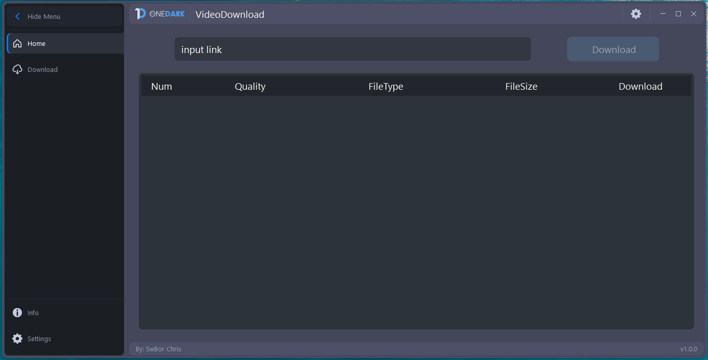
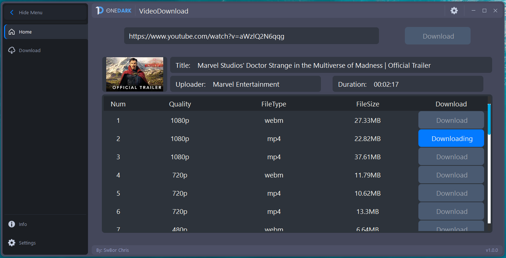
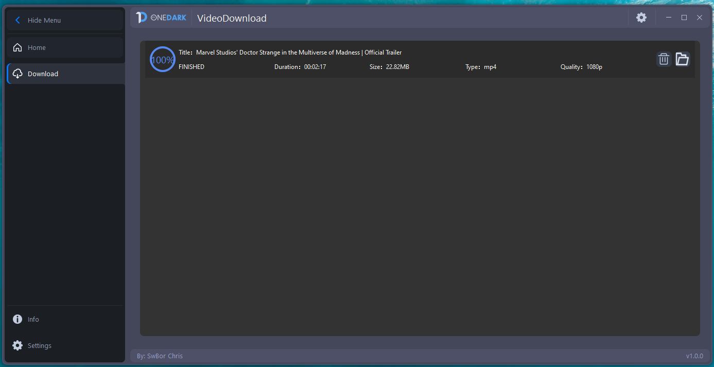
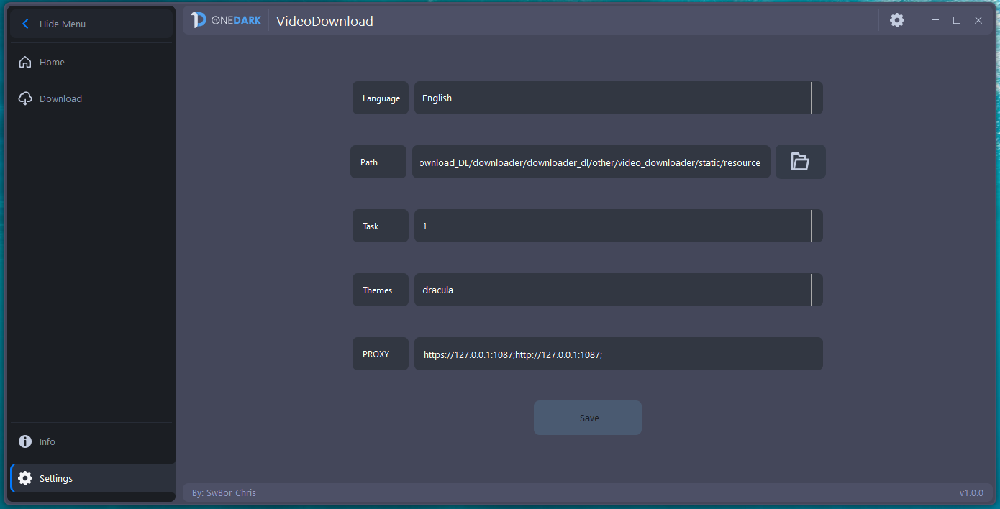

# VideoDownload 
#### According to the [GUI](https://github.com/Wanderson-Magalhaes/PyOneDark_Qt_Widgets_Modern_GUI) project

###### GUI Style
Home 



Download


Setting



### Project configuration mode

#### Download the program file
#### Git Clone files

##### Windows\MacOS

Download the Python configuration environment

```commandline
git clone https://github.com/fjl-gj/VideoDownload.git


pip install ./static/requirements

```


